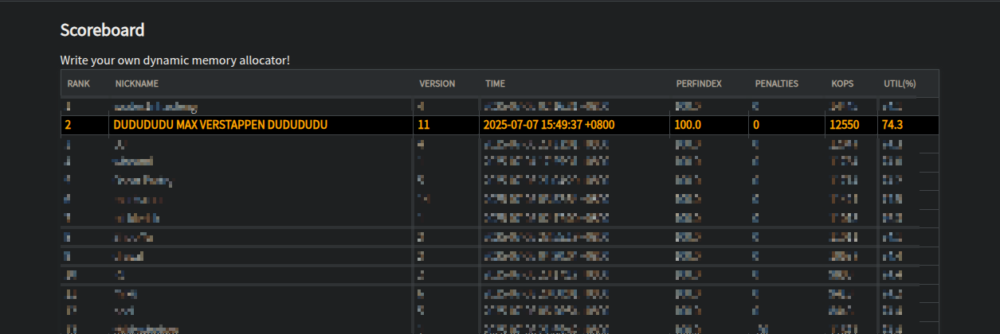

# Autolab Scoreboard Highlighter

A Tampermonkey userscript that automatically highlights your row on Autolab scoreboards for better visibility.

## Installation
1. Install [Tampermonkey](https://www.tampermonkey.net/) for your browser
2. Click [here to install the script](https://github.com/zpatronus/Autolab_Scoreboard_Highlighter/raw/main/autolab-highlighter.user.js)
3. Visit any Autolab scoreboard page (e.g., `https://autolab.andrew.cmu.edu/courses/*/assessments/*/scoreboard`)